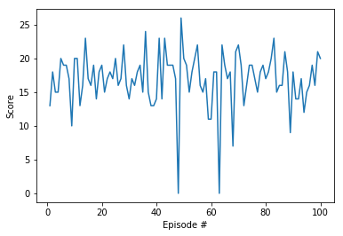

# Report

Double DQN with epsilon-greedy exploration is considered to solve the environment. A random search is used to determine optimal hyperparameters to minimise the training time.

- Average score over 100 episodes is 16.93.
- Environment is solved in approx. 550 episodes (average score > 13.0 for 100 episodes)

Q-Network uses batch normalization with ReLu activation function at each hidden layer. 

For exploration, epsilon is linearly decayed from an inital to a final value in a given number of episodes.

The hyperparameters of the model are:

Parameter | Value | Description
------------ | ------------- | -------------
Replay start size | 0 | Replay memory initial size
Replay size | 100 000 | Replay memory max size 
Batch size | 32 | Batch size * Update every
Update every | 4 | Learn every # of it.
Gamma | 0.99 | Discount rate 
Hidden layers | [100,200,100] | Q-Network
Tau | 0.05 | Soft update rate 
Learning rate | 5e-05

while the training characteristics are:

Parameter | Value | Description
------------ | ------------- | -------------
Episodes | 1000 | # of episodes
Steps | 2000 | Maximum # of steps per episode
Final score | 16.93| Average score after training (100 episodes)
Episode before solve | 550 | Average score of 13.0 (100 episodes)
Initial epsilon | 1.0 |
Final epsilon | 0.01 |
Final exploration episode | 500 | 

The figures below illustrate respectively the average score over 100 episodes and the loss during training.  

Finally, the figure below illustrates the score for 100 episodes after training.

It is observed that further training of the agent could increase the average score. Two episodes have approx. a score of 0.0. Implementing prioritized experience replay could help maximize the training from those bad examples.